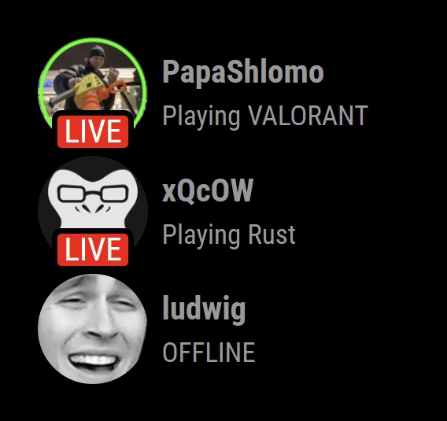
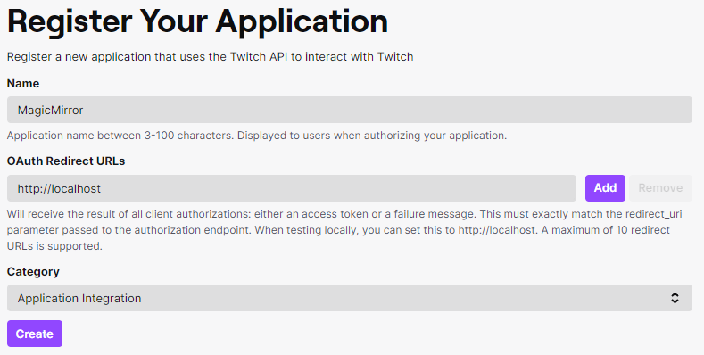
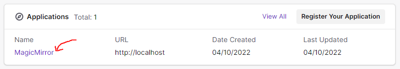
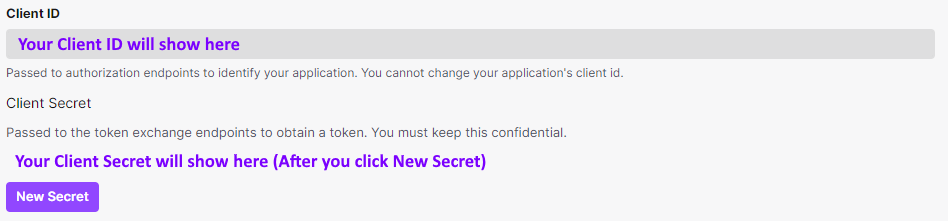

# MMM-TwitchAlert
 

### Screenshot Example


### Prerequisites
This modules uses the free Twitch API. You will need to do some additional steps before the module runs.\
Don't worry, this is easy and well documented if you have troubles!

### Installation
1. `cd modules` from your MagicMirror folder
2. `git clone https://github.com/WilliamFitzjohn/MMM-TwitchAlert.git`
3. `cd MMM-TwitchAlert`
4. `npm i` to install the module

### API Key
1. Navigate to https://dev.twitch.tv/login and login using your twitch account.
2. Go into your account settings and enable 2FA. It is required to get your API key.
3. Go to https://dev.twitch.tv/console and click `Register Your Application` under the Applications tab <br> 
    1. Set `Name` to something like `MagicMirror`
    2. Set `OAuth Redirect URLs` to `http://localhost`
    3. Set `Category` to `Application Integration`
    4. Click `Create`
4. Now open up your new application <br> 
5. Click `New Secret` and copy the Client ID and Client Secret into the MagicMirror config <br> 

### Config
Add this to your MagicMirror config file
```javascript
{
    module: "MMM-TwitchAlert",
    position: "bottom_left",
    config: {
        client_id: "INSERT_CLIENT_ID_HERE",
        client_secret: "INSERT_CLIENT_SECRET_HERE",
        // live_only: false,
        // show_live_badge: false,
        // update_interval: 3, //minutes
        streamers: [
            "papashlomo",
        ],
    },
},
```

### Config Arguments
Argument | Type | Description | Required | Default Value
-|-|-|-|-
client_id | string | Client ID of your application in the Twitch API | Yes | N/A
client_secret | string | Client Secret of your application in the Twitch API | Yes | N/A
streamers | string[] | List of streamers you wish to track | Yes | N/A
live_only | boolean | Only show live streamers on your mirror | No | true
show_live_badge | boolean | Show the "live" badge | No | true
update_interval | integer | How many minutes between updating data (min = 1) | No | 5
alignment | string | 'left' or 'right' align the module | No | 'left'
